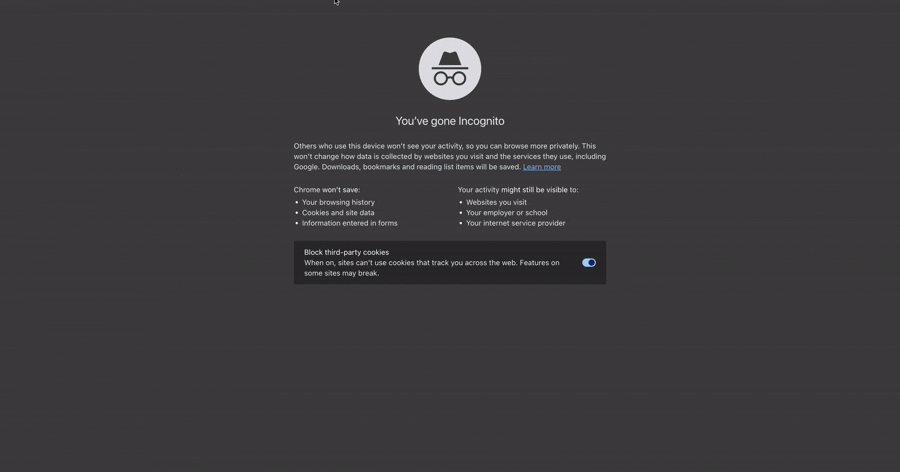
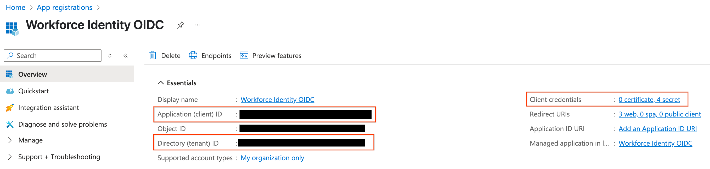
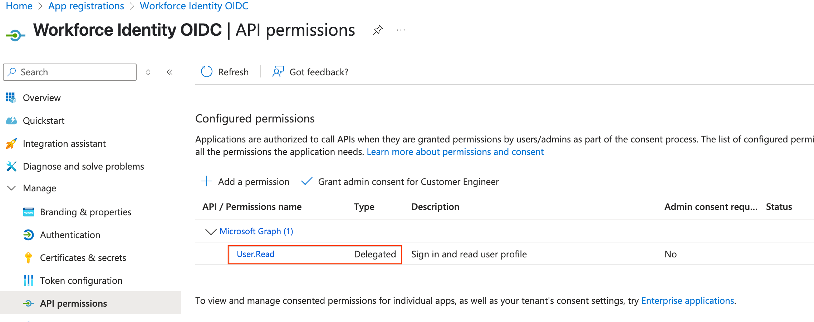

# Google Discovery Engine Search with Workforce Identity and Multiple Identity Providers

## Introduction

This project is a Node.js Express web application that demonstrates an authentication and authorization flow involving multiple identity providers (IdPs) to securely access Google Cloud services.

The key features include:

1.  **Initial User Authentication:** Users first authenticate with Okta using the OpenID Connect (OIDC) protocol.
2.  **On-Demand Microsoft Entra ID Authentication:** For specific actions (like performing a search), the user is interactively authenticated with Microsoft Entra ID.
3.  **Workforce Identity Federation:** The ID token obtained from Entra ID is then exchanged for a Google Cloud access token via [Workforce Identity Federation](https://cloud.google.com/iam/docs/workload-identity-federation-with-other-clouds#azure). This allows Entra ID identities to securely access Google Cloud resources without needing separate Google Cloud identities or long-lived service account keys.
4.  **Google Discovery Engine Integration:** The federated Google Cloud credential is used to authorize requests to the Google Discovery Engine API, enabling secure, identity-aware search functionality and access control.

This setup is designed for scenarios where an organization uses Okta, or another provider, as its primary IdP, but also Microsoft Entra ID for certain user segments or applications. In these scenarios, the group claims and token from Entra ID may be needed to securely enforce access control of Discovery Engine data sources.




## Google Disclaimer
This is not an officially supported Google product

## Prerequisites

Before you can run this project, ensure you have the following set up and configured:

1.  **Okta Account and OIDC Application:**
    *   An Okta account.
    *   An OIDC Web Application configured in Okta with:
        *   Client ID (`OKTA_CLIENT_ID`)
        *   Client Secret (`OKTA_CLIENT_SECRET`)
        *   Okta Issuer URI (`OKTA_ISSUER`)
        *   Sign-in redirect URI: `APP_BASE_URL/authorization-code/callback`

2.  **Azure AD Tenant with Microsoft Entra ID and Application Registration:**
    *   An Azure AD tenant.
    *   An Application Registration in Azure AD with:
        *   Application (client) ID (`AZURE_CLIENT_ID`)
        *   Directory (tenant) ID (`AZURE_TENANT_ID`)
        *   A client secret (`AZURE_CLIENT_SECRET`)
        *   A "Web" platform configured with a Redirect URI: `APP_BASE_URL/auth/azure/callback`
        *   API permissions for Microsoft Graph (e.g., `User.Read` under Delegated permissions) or `https://graph.microsoft.com/.default`.
    ]
    ]

3.  **Google Cloud Platform (GCP) Project:**
    *   A GCP Project for this deployment (`PROJECT_ID`).
    *   A GCP Project Number (`PROJECT_NUMBER`).
    *   **Workforce Identity Federation Configured:**
        *   A Workforce Identity Pool.
        *   An OIDC provider within that pool configured to trust your Entra ID application. The provider's audience string will be `GOOGLE_WIF_AUDIENCE`.
        *   Appropriate IAM permissions granted to the federated identities (e.g., roles/discoveryengine.user) to access the Discovery Engine.
    *   **Google Discovery Engine API Enabled.**
    *   A Discovery Engine Data Store/Engine created (`DISCOVERY_ENGINE_DATA_STORE_ID`).
    *   A Discovery Engine Project ID (`GOOGLE_PROJECT_ID`).

5.  **Environment Variables:** All necessary environment variables (see deployment script below) must be set in your local environment or deployment configuration.

## Deployment
```bash
REGION=
PROJECT_ID=
PROJECT_NUMBER=
OKTA_CLIENT_ID=
OKTA_ISSUER=
OKTA_CLIENT_SECRET=
AZURE_CLIENT_ID=
AZURE_TENANT_ID=
AZURE_CLIENT_SECRET=
DISCOVERY_PROJECT_ID=
GOOGLE_WIF_AUDIENCE=
DISCOVERY_ENGINE_DATA_STORE_ID=
APP_BASE_URL=
EXPRESS_SECRET=

printf 'y' |  gcloud services enable artifactregistry.googleapis.com
printf 'y' |  gcloud services enable cloudbuild.googleapis.com
printf 'y' |  gcloud services enable run.googleapis.com

gcloud iam service-accounts create cloudrun-build-sa \
  --description="Custom Cloud Run Build Service Account" \
  --display-name="Custom Cloud Run Build Service Account"

gcloud projects add-iam-policy-binding ${PROJECT_ID} \
--member=serviceAccount:cloudrun-build-sa@$PROJECT_ID.iam.gserviceaccount.com \
--role=roles/cloudbuild.builds.builder

gcloud projects add-iam-policy-binding ${PROJECT_ID} \
--member=serviceAccount:cloudrun-build-sa@$PROJECT_ID.iam.gserviceaccount.com \
--role='roles/logging.logWriter'

gcloud run deploy agentspace-api-identities \
  --source . \
  --platform managed \
  --region $REGION \
  --allow-unauthenticated \
  --project $PROJECT_ID \
  --build-service-account projects/$PROJECT_ID/serviceAccounts/cloudrun-build-sa@$PROJECT_ID.iam.gserviceaccount.com  \
  --set-env-vars="OKTA_ISSUER=$OKTA_ISSUER" \
  --set-env-vars="OKTA_CLIENT_ID=$OKTA_CLIENT_ID" \
  --set-env-vars="OKTA_CLIENT_SECRET=$OKTA_CLIENT_SECRET" \
  --set-env-vars="AZURE_CLIENT_ID=$AZURE_CLIENT_ID" \
  --set-env-vars="AZURE_TENANT_ID=$AZURE_TENANT_ID" \
  --set-env-vars="AZURE_CLIENT_SECRET=$AZURE_CLIENT_SECRET" \
  --set-env-vars="DISCOVERY_PROJECT_ID=$DISCOVERY_PROJECT_ID" \
  --set-env-vars="GOOGLE_WIF_AUDIENCE=$GOOGLE_WIF_AUDIENCE" \
  --set-env-vars="DISCOVERY_ENGINE_DATA_STORE_ID=$DISCOVERY_ENGINE_DATA_STORE_ID" \
  --set-env-vars="EXPRESS_SECRET=$EXPRESS_SECRET" \
  --set-env-vars="APP_BASE_URL=$APP_BASE_URL"
  ```

### License:

This project is licensed under the Apache License.